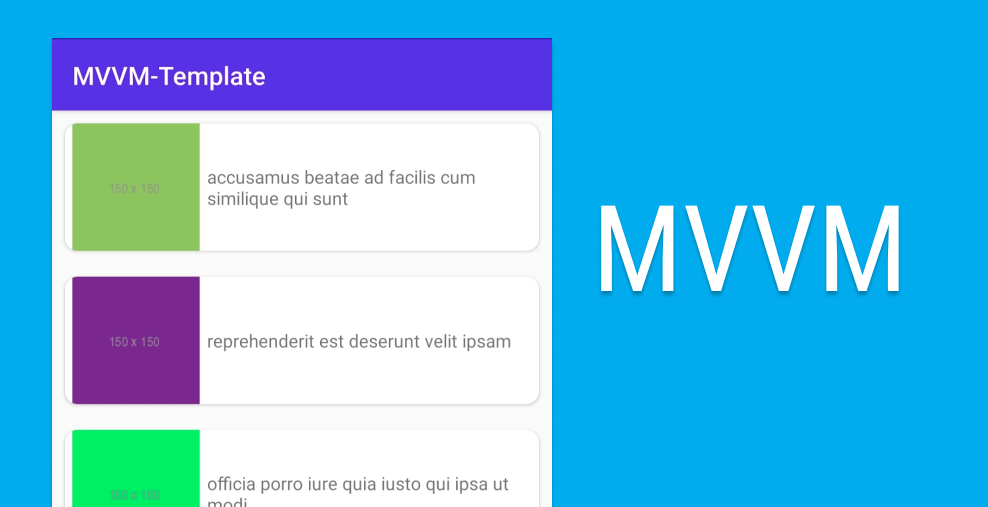
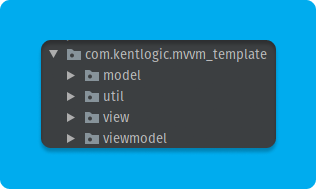

# MVVM-Template

### Try the app [here](https://drive.google.com/file/d/1uN8Baz6dYMyhMcO8gundE8uiXtkyvNBz/view?usp=sharing).

## Below is the directory of the project:

   *The util folder contains the ImageUtil which is used for loading images.* 

## The following external libraries were used on the project:
* Retrofit
* Glide
* RxJava

### The goal of the project is to be able to start with the basic components needed for building an app using the MVVM architecture instead of starting from scratch which can help speed up the development process. Jetpack Navigation and room can be integrated to the template easily.

### Should anyone find this repository, feel free to leave a message [here](https://kentlogic-portfolio.vercel.app/contact) should you have questions or suggestions.

